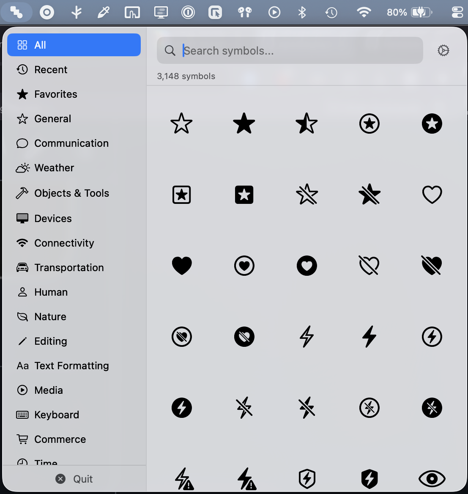

# SymbolDrop

A lightweight macOS menu bar app for browsing and copying SF Symbols. Unapologetically vibe coded as an alternative to the paid options in the App Store.

This app also lets you copy the sumbol itself instead of just the name which is useful for pasting into design tools like Figma. Left click to copy the Unicode character, right-click to copy the symbol name.

[](./screenshot.png)

## Features

- **Menu Bar Access** - Lives in your menu bar, no dock icon
- **Browse Symbols** - Organized by category (Communication, Weather, Transportation, etc.)
- **Quick Search** - Filter symbols by name
- **Copy Two Ways**:
  - **Left-click** - Copy Unicode character (paste into Notes, Pages, etc.)
  - **Right-click** - Copy symbol name (e.g., "star.fill")
- **Visual Feedback** - Green checkmark confirms copy action

## Build & Run

```bash
# Build
xcodebuild -scheme SymbolPicker -destination 'platform=macOS' build

# Run tests
xcodebuild -scheme SymbolPicker -destination 'platform=macOS' test
```

Or open `SymbolPicker.xcodeproj` in Xcode and press ⌘R.

## Requirements

- macOS 14.0+
- Xcode 15.0+
